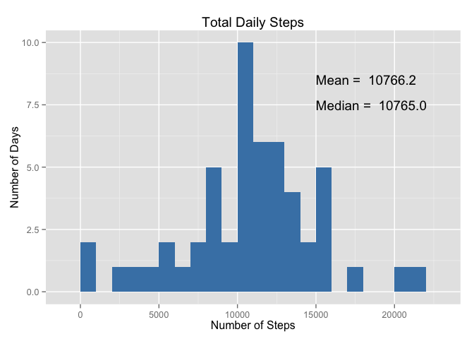
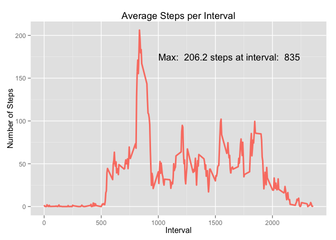
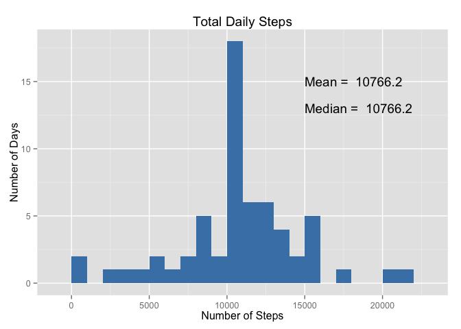
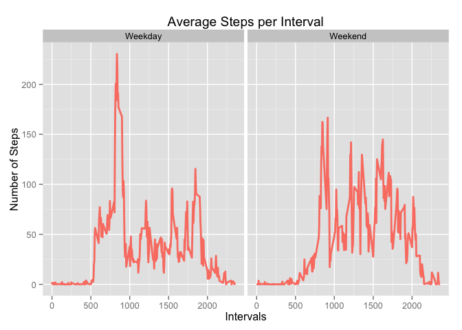

# Reproducible Research: Peer Assessment 1
## Loading required packages


```r
require(data.table)
require(ggplot2)
```

## Loading and preprocessing the data


```r
# Read datatable from file
dt <- fread('activity.csv')
# Build working datatable. First eliminate rows with steps = NA. 
# Then calc sum of steps by date using list() to add a column name
tot_steps <- dt[!is.na(steps) , list(total = sum(steps)), by = date]
```

## What is mean total number of steps taken per day?


```r
# Calculate mean & median
tot_steps_mean <- mean(tot_steps$total)
tot_steps_median <- median(tot_steps$total)

# Draw histogram
g <- ggplot(data = tot_steps, aes(x = tot_steps$total))
g <- g + geom_histogram(binwidth = 1000, fill = 'steelblue')
g <- g + labs(title = 'Total Daily Steps', x = 'Number of Steps', y = 'Number of Days')
g <- g + annotate('text', x = 15000, y = 8.5, label = paste('Mean = ', sprintf('%5.1f', tot_steps_mean)), hjust = 0)
g <- g + annotate('text', x = 15000, y = 7.5, label = paste('Median = ', sprintf('%5.1f', tot_steps_median)), hjust = 0)
print(g)
```

 

The **mean** total number of steps is **10766.2**.  
The **median** total number of steps is **10765.0**.  


## What is the average daily activity pattern?


```r
# Build new datatable with the average number of steps grouped by interval
avg_steps_int <- dt[!is.na(steps), list(avg = mean(steps)), by = interval]

# Get the interval with the max number of steps to report
max_avg<- avg_steps_int[avg == max(avg_steps_int$avg), list(interval, avg)]

# Draw the line chart
g <- ggplot(data = avg_steps_int, aes(x = avg_steps_int$interval, y = avg_steps_int$avg))
g <- g + geom_line(aes(group=1), color = 'salmon', size = 1.1)
g <- g + annotate('text', x = 1000, y = 175, label = paste('Max: ', sprintf('%5.1f steps', max_avg$avg), 'at interval: ', max_avg$interval), hjust = 0)
g <- g + labs(title = 'Average Steps per Interval', x = 'Interval', y = 'Number of Steps')
print(g)
```

 

The maximum number of average steps, **206.2**, occurs at the **835** interval. Around that hour shows a the higher peak in activity, probably associated with commuting to work.   
There is three more smaller peaks around noon (lunch time), at the middle of the afternoon, and at the end of the office hours.  
Activity during night hours are low as expected.


## Imputing missing values


```r
# Build new datatable. Merge original dt and average steps dt
tot_steps_new <- merge(dt, avg_steps_int, by = 'interval')
# Create a new column with the average number of steps for the interval if NA. 
# Current value, otherwise. 
tot_steps_new <- tot_steps_new[ , newsteps := ifelse(is.na(steps), avg, steps)]
# Include a column with the sum of the newsteps.
tot_steps_new_h <- tot_steps_new[ , list(total_newsteps = sum(newsteps)), by = date]
# Build a datatable with steps = NA, and count grouped by date
rows_na <- tot_steps_new[is.na(steps), .N, by = date]
# Calculate total rows with NA values.
tot_rows_na <- sum(rows_na$N)
# Calculate new mean and median values to report
tot_steps_new_mean <- mean(tot_steps_new_h$total_newsteps)
tot_steps_new_median <- median(tot_steps_new_h$total_newsteps)

# Draw histogram
g <- ggplot(data = tot_steps_new_h, aes(x = tot_steps_new_h$total_newsteps))
g <- g + geom_histogram(binwidth = 1000, fill = 'steelblue')
g <- g + labs(title = 'Total Daily Steps', x = 'Number of Steps', y = 'Number of Days')
g <- g + annotate('text', x = 15000, y = 15, label = paste('Mean = ', sprintf('%5.1f', tot_steps_new_mean)), hjust = 0)
g <- g + annotate('text', x = 15000, y = 13, label = paste('Median = ', sprintf('%5.1f', tot_steps_new_median)), hjust = 0)
print(g)
```

 

There are a total of **2304** intervals with no recorded data, corresponding to **8** days.  
The missing values were filled in using the average for the corresponding 5-minute interval, based on the datatable built for the previous question.  
Given the method selected to fill in the NA cases, the **mean** remains the same, **10766.2**, and the **median** increased to **10766.2**, equal to the mean. 


## Are there differences in activity patterns between weekdays and weekends?


```r
# Add new column to datatable with type of day using wday() from data.table package
tot_steps_new <- tot_steps_new[ , day_type := ifelse((wday(date) == 1 | wday(date) == 7) , 'Weekend', 'Weekday')]

# Change to type of day column to factor
tot_steps_new$day_type <- as.factor(tot_steps_new$day_type)
tot_steps_new_l <- tot_steps_new[, list(avg_newsteps = mean(newsteps)), by = c('interval', 'day_type')]

# Draw line charts faceted by type of day
g <- ggplot(data = tot_steps_new_l, aes(x = interval, y = avg_newsteps, group = day_type))
g <- g + geom_line(color = 'salmon', size = 1.0)
g <- g + facet_grid(. ~ day_type)
g <- g + labs(title = 'Average Steps per Interval', x = 'Intervals', y = 'Number of Steps')
print(g)
```

 

During weekdays the peaks around commuting hours are higher, while the activity during the weekends seems to be more evenly distributed.  
Night hours activity still shows low to null levels, but shows a peak around dinner time on weekends.  


